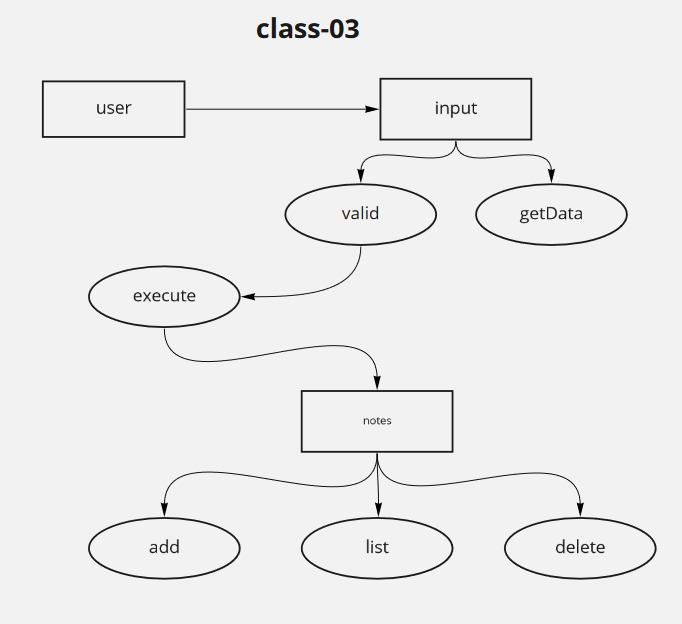

# Author: Osama Hanoun

Notesy is a Command Line Interface package that gives the ability to take notes.

## Commands for Adding Text 
- We start by typing node .
- To save text one of two commands can be used.
```
-add
```
- Next we can type our text and hit enter to save.
```
The above step combined will look something like this.
node . -add 'Save some text'
```

# Dependencies 
``` 
* npm init
* npm install minimist 
* npm install --save-dev jest

```
